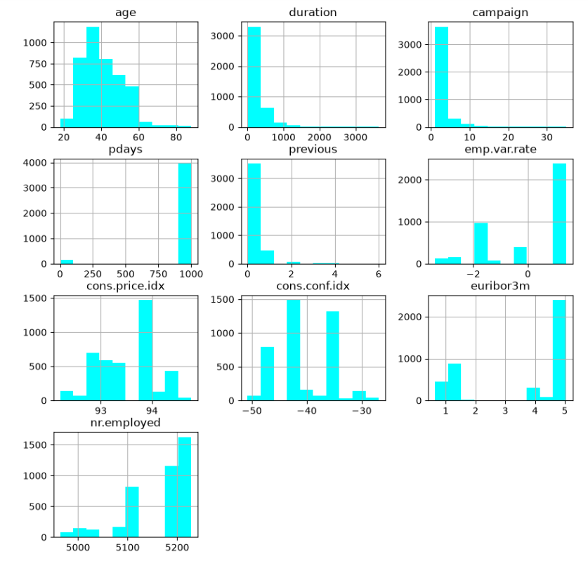
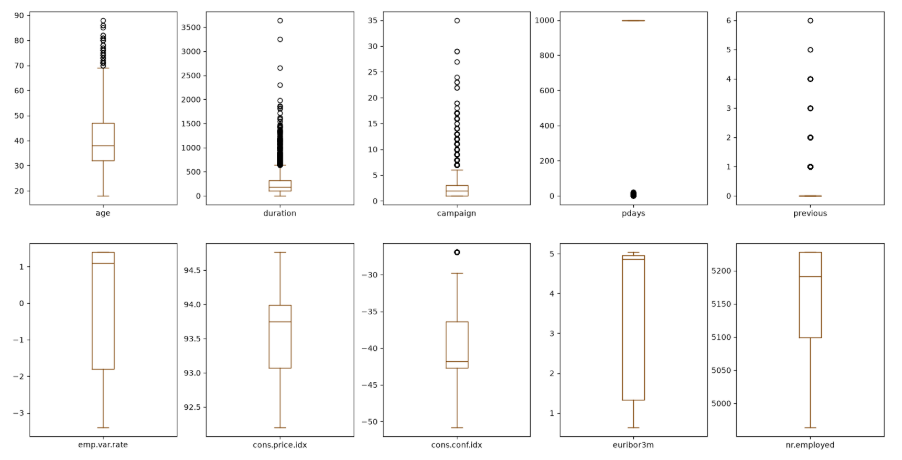
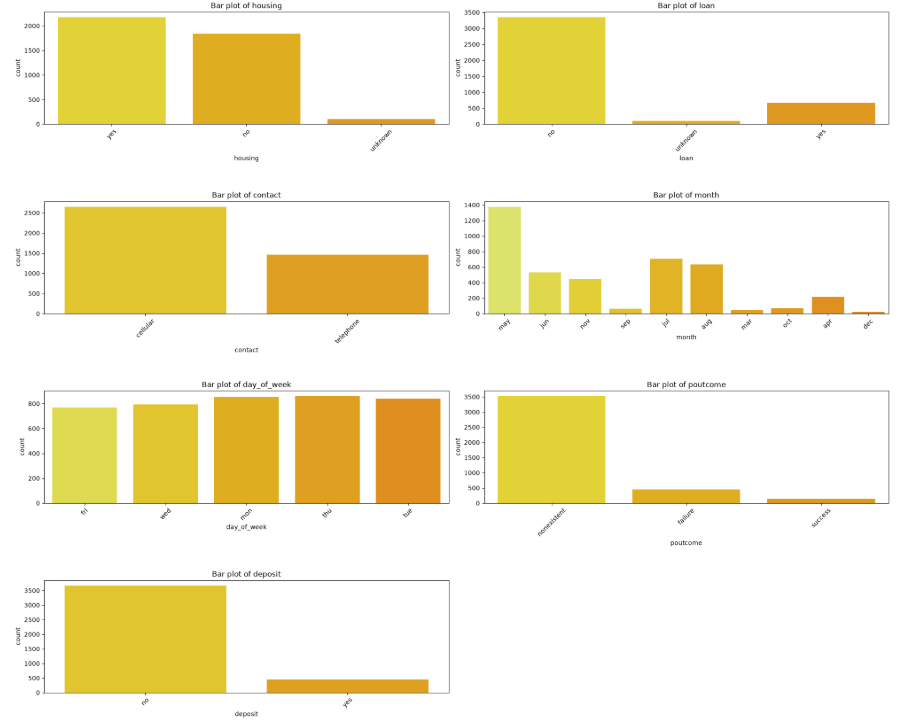
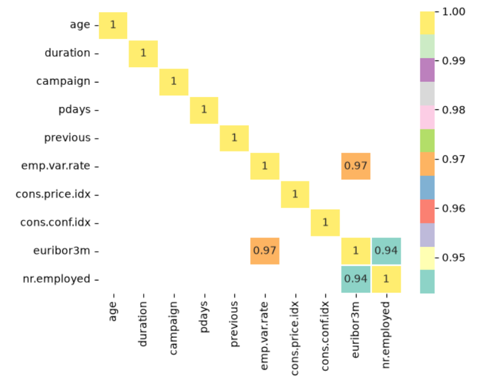
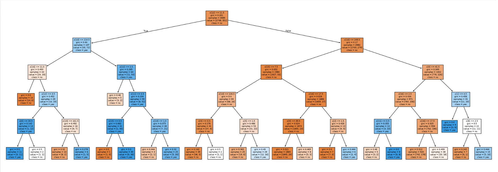

# 🌳 PRODIGY_DS_03 - Decision Tree Classifier

## 📌 Internship

**Company:** Prodigy InfoTech  
**Track:** Data Science (DS)  
**Task:** 03 - Decision Tree Classifier

---

## 📖 Project Overview

This project focuses on building a **Decision Tree Classification Model** to predict whether a customer will subscribe to a bank term deposit based on demographic and behavioral information.

The project includes data preprocessing, exploratory data analysis, feature encoding, model training, prediction, and performance evaluation using a Decision Tree Classifier.

---

## 🎯 Objective

Build a **Decision Tree Classifier** to predict customer purchase/subscription behavior using demographic, financial, and marketing campaign data.

---

## 📂 Dataset

**Dataset Used:** Bank Marketing Dataset

The dataset contains customer information such as:

- 👤 Age
- 💼 Job
- 💍 Marital Status
- 🎓 Education
- 💳 Default Status
- 🏦 Housing Loan
- 💰 Personal Loan
- ☎️ Contact Type
- 📅 Month of Contact
- ⏳ Campaign Information
- 📈 Previous Marketing Outcome
- ✅ Subscription Decision (Target Variable)

---

## 🛠️ Technologies Used

- Python
- Pandas
- NumPy
- Matplotlib
- Seaborn
- Scikit-learn
- Jupyter Notebook
- VS Code

---

## 📊 Project Workflow

The following steps were performed:

- ✅ Loaded the dataset
- ✅ Explored dataset structure
- ✅ Handled missing values (if any)
- ✅ Encoded categorical variables
- ✅ Selected features and target variable
- ✅ Split the dataset into training and testing sets
- ✅ Trained a Decision Tree Classifier
- ✅ Predicted customer subscription behavior
- ✅ Evaluated model performance
- ✅ Performed Exploratory Data Analysis
- ✅ Analyzed numerical and categorical features
- ✅ Performed correlation analysis
- ✅ Visualized the Decision Tree

---

## 📈 Visualizations

The project includes:

- 📊 Numerical Feature Distributions
- 📦 Boxplot Analysis
- 📊 Categorical Feature Analysis
- 🔗 Correlation Heatmap
- 🌳 Decision Tree Visualization

---

## 📸 Project Output


### 📊 Exploratory Data Analysis

#### Numerical Feature Distributions


---

#### Boxplot Analysis


---

#### Categorical Feature Analysis


---

### 🔗 Correlation Analysis


---

### 🌳 Decision Tree Classifier


---

## 🔍 Key Insights

- Customer demographics influence subscription decisions.
- The `age` variable is mainly concentrated around the middle-age range.
- The `duration` variable has a highly skewed distribution.
- Most customers were contacted a relatively small number of times during the campaign.
- Married customers represent the largest marital-status category.
- University degree and high-school categories represent a significant portion of the education distribution.
- Cellular communication is the dominant contact method.
- The target variable contains more `no` responses than `yes` responses.
- `emp.var.rate` and `euribor3m` show a strong positive correlation.
- `euribor3m` and `nr.employed` also show a strong positive correlation.
- Decision Trees provide an interpretable way to classify customer responses.
- Exploratory Data Analysis helps identify patterns and relationships that can be useful for customer classification.

---

## 📁 Project Structure

```text
PRODIGY_DS_03/
│
├── data/
│   └── bank.csv
│
├── images_task3/
│   ├── task3_img1.png
│   ├── task3_img2.png
│   ├── task3_img3.png
│   ├── task3_img5.png
│   └── task3_img6.png
│
├── Task3.ipynb
│
├── README.md
└── bank.csv

## ▶️ How to Run the Project

### 1️⃣ Clone the Repository

```bash
git clone https://github.com/aaradhyakmbj/PRODIGY_DS_03.git
```

### 2️⃣ Navigate to the Project Directory

```bash
cd PRODIGY_DS_03
```

### 3️⃣ Install Required Libraries

```bash
pip install pandas numpy matplotlib seaborn scikit-learn jupyter
```

### 4️⃣ Launch Jupyter Notebook

```bash
jupyter notebook
```

### 5️⃣ Open the Notebook

Open **Decisiontreeclassifier.ipynb** and run all the cells to reproduce the analysis, model training, predictions, and visualizations.

---

## 📌 Conclusion

This project demonstrates the application of Decision Tree Classification for solving a real-world bank marketing classification problem.

Through data preprocessing, exploratory data analysis, visualization, model training, and evaluation, valuable insights were gained into customer characteristics and marketing campaign outcomes.

The Decision Tree model provides an interpretable approach for understanding how different customer and campaign-related features contribute to classification decisions.

---

## 👩‍💻 Author

**Aaradhya Kamboj**

📊 Data Analyst Intern | Prodigy Infotech

**Internship:** Prodigy InfoTech – Data Science

GitHub: https://github.com/aaradhyakmbj
